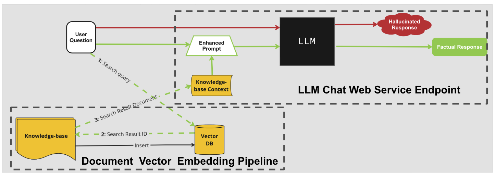
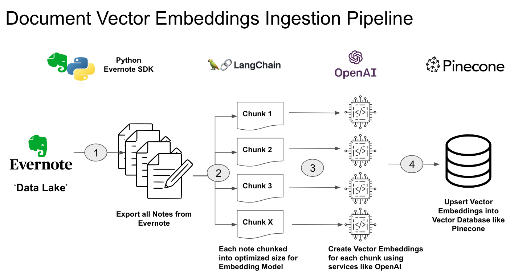
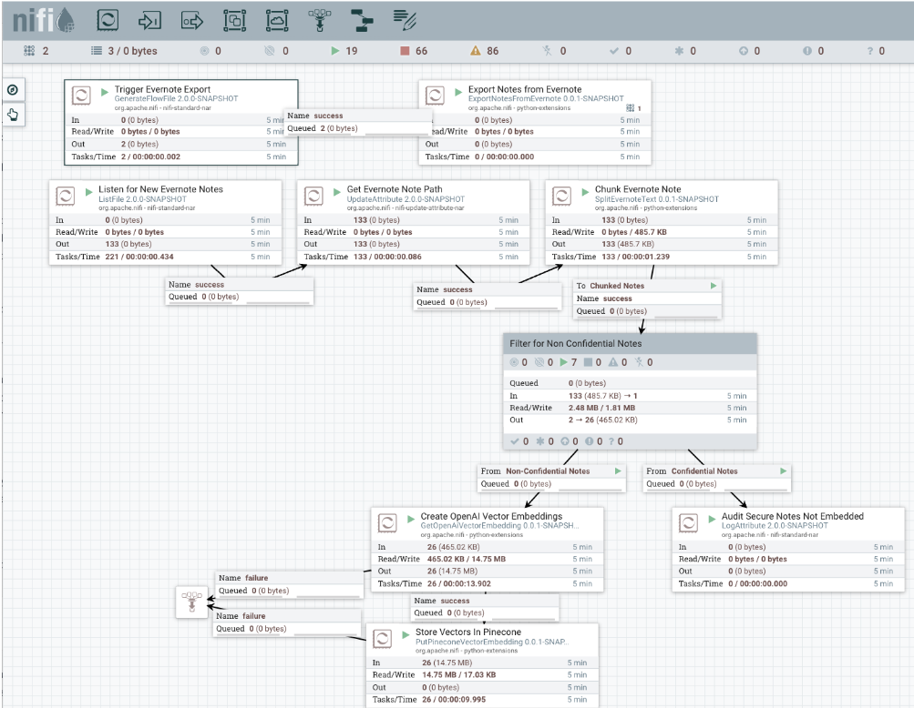
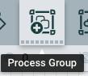
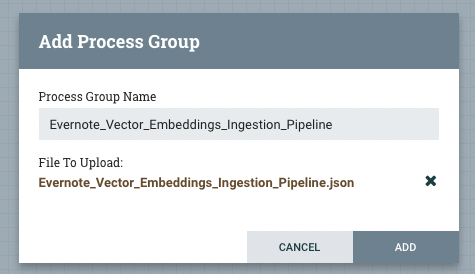

# Evernote AI Chatbot Powered by Apaceh NiFi 2.0, OpenAI, Pinecone and LangChain

## Use Case Context

Evernote, a leading and powerful note-taking tool, can be a labyrinth of text, documents, images, and audio recordings accumulated over time. Navigating and exploring this vast collection of notes can be challenging.

This projects shows how to create a chat-like AI interface to Evernote  leveraging the highly anticipated Apache NiFi 2.0 release and its seamless Python integration and various generative AI tools. It focuses on rapidly creating AI data pipelines with Apache NiFi, seamlessly integrating various AI ecosystem technologies, such as OpenAI, Pinecone, and LangChain. 

AFter you setup the NIFi flows as per the instructions in this project, you will be able have these types conversational experience your Evernote.

See the following Blog for more details: [Accelerating AI Data Pipelines: Building an Evernote Chatbot with Apache NiFi 2.0 and Generative AI]()
## Prerequisites  / Setup

1. Install Python 3.9 to location $PYTHON_HOME 
   - You will need this to run NiFi Python processors  and stream-lit chatbot web app. Install the following modules in your Python virtual env to run the web app:
      - streamlit
      - streamlit-chat
2. Clone this repo to location $EVERNOTE_CHAT_BOT. 
   - You will need to refer to the custom Python processors in this repo in the the nifi.properties 
3. Build Apache NiFi 2.0 Snapshot release 
   - Build it yourself from the [Apache NiFi Git Repo](https://github.com/apache/nifi) or download it from [here](https://drive.google.com/file/d/1xAuao9rV8F_CQBLqWLWp7P12iZpuuUEP/view?usp=drive_link) into this location $NIFI_HOME 
4. Confiugure NiFi
     - Modify the $NIFI_HOME/confi/nifi.poperties for the following properties
       - nifi.python.command=$PYTHON_HOME
         - e.g:  nifi.python.command=/opt/homebrew/Cellar/python@3.9/3.9.17/bin/python3.9
       - nifi.python.extensions.source.directory.dev=$EVERNOTE_CHAT_BOT/nifi-processor
         - e.g: If you clone this repo to folder evernote-ai-chat-bot, then it woudl be: nifi.python.extensions.source.directory.dev=/evernote-ai-chatbot/nifi-processor
     - Modify the $NIFI_HOME/python/framework/py4j/java_gateway.py to add the following import statement. It needs to be added after the first import statement of 'from __future__ import unicode_literals, absolute_import'
	     - from concurrent.futures import ThreadPoolExecutor
     - Modify the $NIFI_HOME/python/api/nifiapi/properties.py to replace the line 'values = gateway.jvm.java.util.ArrayList()' with:
	     - values = gateway.jvm.java.util.LinkedHashSet()
         
5. Start NiFi
   - Follow the instructions to start NIFi: [Starting NiFi](https://nifi.apache.org/docs/nifi-docs/html/getting-started.html#starting-nifi)
   - Configure credentials and access the NiFi UI by following the instructions:  [I started NIFi, Now what?](https://nifi.apache.org/docs/nifi-docs/html/getting-started.html#i-started-nifi-now-what)
6. Signup for a free account on [Pinecone](https://www.pinecone.io/) and create an index through the console or the SDK. Save your Pinecone API key information. See the [Pinecone Quickstart Guide](https://docs.pinecone.io/docs/quickstart). You will need these to store and retrieve your vector embeddings of your Evernote notes. 
7. Create an account on [OpenAI](https://platform.openai.com/) and create a secret API key. You will need this to to work with OpenAI embeddings model to vector embeddings and their LLM models.
8. Create Evernote Developer token. See: [Developer Tokens](https://dev.evernote.com/doc/articles/dev_tokens.php)

# Architecture

In recent months, various examples and reference architectures have emerged for using LLM services like OpenAI with the contextual data from your data lakes (e.g.:  Evernote). One such architecture is called retrieval augmented generation (RAG), which combines LLM generative capabilities with the ability to retrieve information from your data lakes using vector databases populated by data in your lake. The RAG architecture looks like the following:

This architecture pulls in various architectural components in the AI ecosystem, including foundation language learning models, vector databases, labeling, prompt engineering, etc. As the above diagram illustrates with the dotted boxes, the architecture requires at least two AI data pipelines to be implemented:
- **Document Vector Embedding Ingestion Pipeline** - Collect the documents from your data lake/knowledge base, create a vector embedding, and ingest them into a vector database. 
- **LLM Chat Web Service Endpoint** - Endpoint takes the user request, including current question and chat history, creates a vector embedding, searches for similar documents in the vector database based on the request, and sends the user request and the contextual documents to the LLM to get the next response in the chat conversation.

The below sections outlines how to build these AI pipelines using NIFi.

# Vector Embeddings Ingestion Pipeline 

Document vector embedding pipeline for notes in Evernote is as follows:

The above flow was implemented with NiFi using the following flow:

Follow the below instructions to get this flow running:

1. Import the NiFi flow Evernote_Vector_Embeddings_Ingestion_Pipeline onto the NiFi canvas
* Add the Process Group Icon located in top menu bar to the canvas 
* 	
* Select the NiFi flow called Evernote_Vector_Embeddings_Ingestion_Pipeline located under nifi-processors and click add
* 	 
2. Configure the Parameter Context for the different config values required to run the flow
* 	Select the Parameter Context from the hamburger menu
	*  	xx
*   Edit the parameter context name called VectorEmbeddingIngestion and configure the following parameters and leave the others to the default values
	*   evernote_auth_key - This is the Evernote developer token to connect to the Evernote APIs
	*   evernote_export_directory - A directory on your local file system where the notes will be exported in .enex format.
	*   evernote_export_from_dtm - The start date that you want to export notes from. Only notes with the update value > this value will be exported
	*   evernote_stack_filter - If you want to only export notebooks/notes from a specific Stack. If you want to export all, then set it to an empty string
	*   pincone_evernote_namespace - Namespace within the pinecone index where the embeddings will be stored. Configure with a unique name.  If the configured namespace doesn't exist, Pinecone will automatically create one
	*   pinecone_evernote_index_name - The index name you must create within the Pinecone UI / SDK.
	*   vector_database_environment - The name of the environment for your pinecone cloud instance. This can be found in the API keys section within the Pinecone console
	*   vector_database_service_api_key - The API key used to connect to your pinecone instance. This can be found in the API keys section within the Pinecone console
	*   vector_embedding_model_service_api_key - The API key used to connect to OpenAI. This can be found in [OpenAI Platform Console](https://platform.openai.com/account/api-keys)  
3. Start Controller Services and the Flow. The flow will pull all the notes in Evernote based on the date and filter configured and then will incrementally process new notes as they are created in Evernote. 
	* Right-click on Canvas and Select Enable all controller services
	* Right-click on the Canvas and Select 

4. If the flow is processing successfully, you should immediately see vector embeddings in Pinecone and the number of vectors increasing.

	
# Troubleshooting
* If you running these on the latest Apple M1/M2 chips that use ARM architecutre, then when running the embedding ingestion flow with the SplitEvernoteText processor: `lxml/etree.cpython-39-darwin.so' (mach-o file, but is an incompatible architecture (have (x86_64), need (arm64e)))` To solve this run build the lxml package your self with: `ARCHFLAGS="-arch arm64" pip3.9 install lxml --compile --no-cache-dir` and then copy the corresponding  lxml package into $NIFI_HOME/work/python/extensions/SplitEvernoteText/0.0.1-SNAPSHOT 

